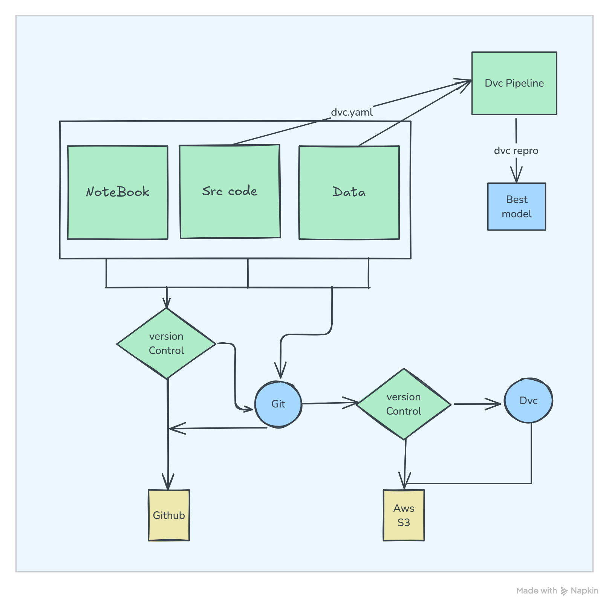
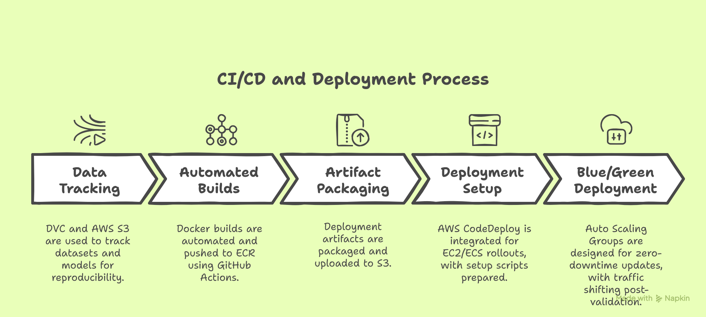

# Hybrid Spotify Recommendation System  
A scalable recommendation system combining collaborative and content-based filtering, deployed on AWS

## 🛠️ Tech Stack  
- **Data & Pipeline**: DVC, AWS S3  
- **CI/CD**: GitHub Actions, Docker, AWS ECR, CodeDeploy  
- **Deployment**: AWS EC2/ECS, Auto Scaling Groups (Blue/Green)  
- **Frameworks**: Streamlit (for UI), Scikit-Learn (ML)

## 📊 System Overview

### Image 1: Machine Learning Workflow with Version Control

- Illustrates a pipeline for developing and versioning a machine learning model.
- Includes Notebook, Source Code, and Data managed with Git and DVC.
- Uses GitHub for code storage and AWS S3 for large datasets/models.
- Features a DVC pipeline (`dvc.yaml`) to automate and reproduce the best model.

### Image 2: CI/CD and Deployment Process

- Depicts the CI/CD pipeline and deployment to production.
- Automates builds with GitHub Actions and Docker, storing images in AWS ECR.
- Packages artifacts and stores them in AWS S3.
- Deploys using AWS CodeDeploy with Blue/Green strategy for zero-downtime updates.

## 🔍 Technical Implementation
### Content-Based Filtering
Below is an example of a content-based filtering recommendation system using cosine similarity to recommend songs based on a target song.

#### Example Data
- `x1 = [1, 2, 3]` (Song A)
- `x2 = [3, 1, 3]` (Song B)
- `x3 = [4, 1, 2]` (Selected Song - Target)
- `x4 = [3, 5, 6]` (Song C)
- `x5 = [5, 6, 9]` (Song D)

#### Step 1: Compute Cosine Similarity
Cosine similarity between vectors  A  and  B  is calculated as:

cos(theta) = A.B /(mod(A)*mod(B))

**Calculations for `x3` vs others:**

| Pair   | Dot Product               | ‖x3‖       | ‖x‖        | Cosine Similarity       |
|--------|---------------------------|------------|------------|-------------------------|
| x3·x1  | (4×1)+(1×2)+(2×3) = 12   | √21 ≈ 4.58 | √14 ≈ 3.74 | 12 / (4.58 × 3.74) ≈ 0.79 |
| x3·x2  | (4×3)+(1×1)+(2×3) = 19   | √21 ≈ 4.58 | √19 ≈ 4.36 | 19 / (4.58 × 4.36) ≈ 0.94 |
| x3·x4  | (4×3)+(1×5)+(2×6) = 29   | √21 ≈ 4.58 | √70 ≈ 8.37 | 29 / (4.58 × 8.37) ≈ 0.83 |
| x3·x5  | (4×5)+(1×6)+(2×9) = 44   | √21 ≈ 4.58 | √142 ≈ 11.92 | 44 / (4.58 × 11.92) ≈ 0.85 |

#### Step 2: Sort and Recommend
Ranked by similarity to `x3`:
- `x2` (Song B): 0.94
- `x5` (Song D): 0.85
- `x4` (Song C): 0.83
- `x1` (Song A): 0.79

#### Final Recommendation
For a user who listens to Song `x3`, recommend:
1. Song B (`x2`)
2. Song D (`x5`)
3. Song C (`x4`)

### Collaborative Filtering
This section describes a collaborative filtering approach for recommending songs based on user engagement data with 9.7 million (97 lakh) users and 34,000 songs.

#### Data Overview
- **Users**: 9.7 million (far exceeding the number of songs).
- **Songs**: 34,000 items.
- **Challenge**: The user-song interaction matrix is sparse, with 9.7M × 34K = ~329.8 billion potential entries, but only a fraction contain actual engagement data (e.g., ratings or listens).

#### Storage Optimization
- Due to the large scale, the data is saved in a **CSR (Compressed Sparse Row) matrix**, which efficiently stores only non-zero entries (e.g., user-song interactions like ratings or play counts).
- This reduces memory usage compared to a dense matrix, making it feasible to handle on scalable infrastructure like AWS.

#### Step 1: Compute User-User or Item-Item Similarity
- Collaborative filtering can use cosine similarity on the CSR matrix to find similar users or songs.
- Example (simplified user-song matrix in CSR format):
  - User 1: [Song 1: 4, Song 3: 2]
  - User 2: [Song 1: 3, Song 2: 5]
  - Cosine similarity is computed on non-zero entries.

#### Step 2: Generate Recommendations
- Based on similarity scores, recommend songs liked by similar users or frequently co-rated songs.
- Example output (hypothetical):
  - For User 1, similar to User 2, recommend Song 2 (rating 5).

### Hybrid Recommender System
This section combines content-based and collaborative filtering for improved recommendations using both matrices.

#### Approach
- **Content-Based Matrix**: Song feature vectors (e.g., `x1` to `x5` from the content-based example).
- **Collaborative Matrix**: User-song interaction matrix stored in CSR format (e.g., 9.7M users × 34K songs).
- **Combination**: Weighted average of similarity scores from both methods.
  - Content-Based Score (e.g., cosine similarity from song features).
  - Collaborative Score (e.g., cosine similarity from user interactions).
  - Hybrid Score = \( w_1 \cdot \text{Content Score} + w_2 \cdot \text{Collaborative Score} \) (where \( w_1 + w_2 = 1 \)).

#### Example Calculation
- For Song `x3` (Target):
  - **Content-Based Scores** (from previous table):
    - `x2`: 0.94
    - `x5`: 0.85
    - `x4`: 0.83
    - `x1`: 0.79
  - **Collaborative Scores** (hypothetical, based on user similarity to others who liked `x3`):
    - `x2`: 0.88
    - `x5`: 0.75
    - `x4`: 0.80
    - `x1`: 0.70
  - **Weights**: ( w_1 = 0.6 )*(content), ( w_2 = 0.4 )*(collaborative).
  - **Hybrid Scores**:
    - `x2`: ( 0.6 * 0.94 + 0.4 * 0.88 = 0.564 + 0.352 = 0.916 )
    - `x5`: ( 0.6 * 0.85 + 0.4 * 0.75 = 0.510 + 0.300 = 0.810 )
    - `x4`: ( 0.6 * 0.83 + 0.4 * 0.80 = 0.498 + 0.320 = 0.818 )
    - `x1`: ( 0.6 * 0.79 + 0.4 * 0.70 = 0.474 + 0.280 = 0.754 )

#### Step 2: Sort and Recommend
Ranked by hybrid score:
- `x2` (Song B): 0.916
- `x4` (Song C): 0.818
- `x5` (Song D): 0.810
- `x1` (Song A): 0.754

#### Final Recommendation (Hybrid)
For a user who listens to Song `x3`, recommend:
1. Song B (`x2`)
2. Song C (`x4`)
3. Song D (`x5`)

## 🌐 Try It Out
You can interact with the recommendation system at the following link:  
(http://3.109.121.62:8000/)
## 📋 Example Input Data
You can download an example input dataset in CSV format from the following link:  
[https://raw.githubusercontent.com/AMR-ITH/music-hybrid-recsys/refs/heads/development/docs/input.csv](https://raw.githubusercontent.com/AMR-ITH/music-hybrid-recsys/refs/heads/development/docs/input.csv)
example input : 
song names --> [Love Story,it's about time,Shake It Off] 
artist name --> [Taylor Swift,jamie cullum,Taylor Swift]

